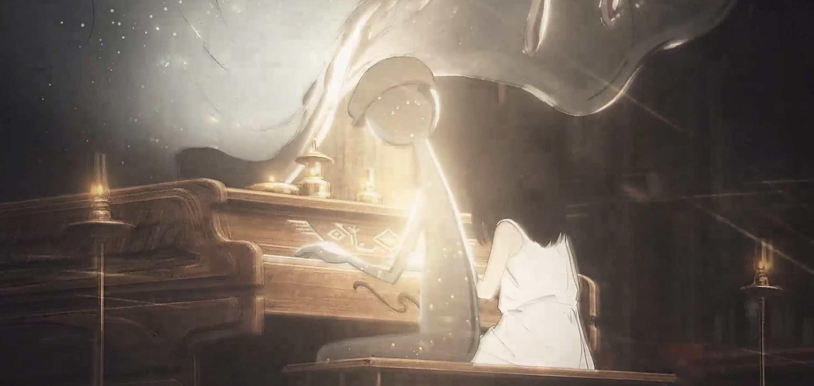
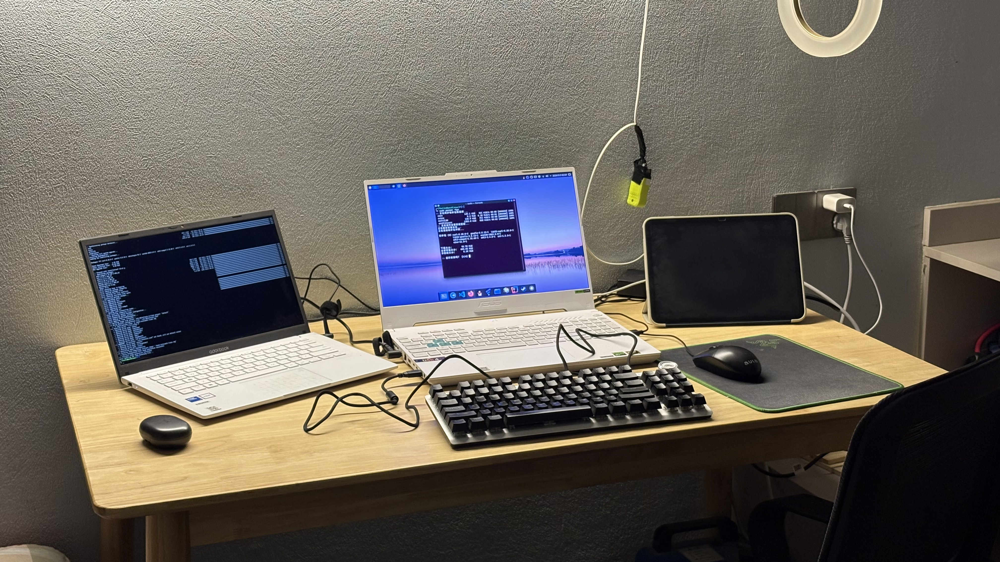

# 关于 Fovlin

Fovlin 是一个就读于化学系的男大学生，性格比较内向，不擅长社交、聊天，喜欢计算机有关的东西，虽然很笨，但目前在学习计算机了，喜欢玩 Minecraft，偶尔玩一些音乐游戏。

## 喜欢的音乐

- [**Antikythera**](https://files.acovia.net/music/antikythera.mp3)

> technoplanet

​<audio id="audio" controls preload loop><source id="mp3" src="https://files.acovia.net/music/antikythera.mp3"></source></audio>

第一次接触这个曲子是在 Rotaeno 和花语旋律的联动曲中，钢琴如雨点般落下，在三连音出现的时候，意象中的大雨也转为了暴雨。

随着曲目钢琴音的放缓，闭上眼睛能看到雨水随花瓣缓缓飘下的场景。

在钢琴逐渐加速，一片嘈杂的电子音过后，钢琴音如暴雨般倾泻而下，将整首歌曲推向高潮。

一阵故障音扑来，歌曲的钢琴音愈发密集，在歌曲最后的三连音结束后，天空也露出了久违的阳光。

---

- [Antikythera \[Vocal Version\]](https://files.acovia.net/music/antikythera-vocal-version.mp3)

> technoplanet / 木下珠子

​<audio id="audio" controls preload loop><source id="mp3" src="https://files.acovia.net/music/antikythera-vocal-version.mp3"></source></audio>

这个较于 Antikythera 插入了木下珠子的人声，歌声婉转，如同在暴雨中吟唱，配合原版的钢琴旋律，所有情绪倾泻而出，极具情感冲击力的一首歌曲。

**部分歌词：**

**永遠に止まぬ雨なら**

> *若是永不停歇的雨*

**名もなき奈落のその剣を取れ**

> *就拿起那无名深渊中的剑吧*

**道なき道を歩いて巡りゆくよ**

> *走在无路的道路上，继续巡回前行*

**彼方の一雫の光と終わりの先**

> *在远方的一滴光辉和终点的尽头*

**新たな世界に希望を抱いて…**

> *怀抱希望，迈向崭新的世界……*

---

- [悔_](https://files.acovia.net/music/悔_.mp3)

> EssBee

​<audio id="audio" controls preload loop><source id="mp3" src="https://files.acovia.net/music/kui_.mp3"></source></audio>

出自 旋转音律 Rotaeno 的支线终章曲目，按照剧情本意，伊洛在好朋友荷珀前往其他星球时，自己未选择和她一起出发感到悔过。

荷珀如星星般在自己的的道路上坚定前行，因而伊洛非常惧怕被抛弃，在最后，伊洛也终于做出了决定，决心随荷珀的路线出发，追上前方那个闪耀的明星。

**部分歌词：**

> **美しく透明なアオは**

> *那抹美丽而透明的蓝*

> **見えなくなっても輝く**

> *即便在无人目睹旅途中 也依然闪耀着*

> **無情な旋律 それは選ばれた**

> *这无情的旋律 是我自己的选择*

> **だった一つ偽りの道なり**

> *原来这一切 不过是始于虚妄的漫长旅途*

---

- [Bloom](https://files.acovia.net/music/bloom.mp3)

> Chamber Chu

​<audio id="audio" controls preload loop><source id="mp3" src="https://files.acovia.net/music/bloom.mp3"></source></audio>

怀揣着对音乐的热爱，将自己心中的生命乐章呈现在琴键上吧，无论暴雨是否会停息，无论明天是否会更好，只要演奏音乐，就能换来晴天！

当你触及琴键的那一刻，旋律便是你的灵魂的歌声，献上你的生命乐章。

---

- [Away from the rain](https://files.acovia.net/music/away-from-the-rain.mp3)

> Chamber Chu

​<audio id="audio" controls preload loop><source id="mp3" src="https://files.acovia.net/music/away-from-the-rain.mp3"></source></audio>

花语旋律主题曲，太多的情感被寄托在旋律其中，歌曲结尾，听似杂乱无章的钢琴音，却是雨的旋律。

## 喜欢做的事

貌似没有特别喜欢的事，微信 QQ 常年也没有消息，每天最喜欢的事就是坐在 Linux 系统前呆着，干净简洁的系统里装着我的一切。

爸爸妈妈说我很宅，应该多出去转转，但是我觉得外面无非是换个地方听音乐而已。

> Fovlin 的工作台

虽然说是喜欢计算机，但是并没有什么拿得出手的项目，没有系统性学习过一门编程语言。

早些年可能会喜欢化学，这是一门很神奇的学科，能够化物利民，但后来觉得自己无非是在重复别人重复过无数次的实验罢了（

> 化学这东西特别伤身体哦！

硬要说运动的话，我喜欢散步，家乡的公园超极大超级美！尤其是在春季那万紫千红的季节，山坡上的各种树开出五颜六色的花朵，嫩绿的杨柳随风飘扬，透过湖中还可以看到另一个世界！

喜欢追番，喜欢到不敢看的程度，因为总觉得番剧看一个少一个，其次自己大概率会因为看完一部番而出现戒断反应（

[...](./sketch/unknow-1)