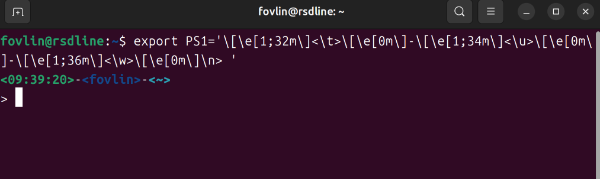
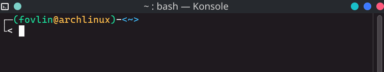

# 修改 PS1 环境变量自定义终端外观

Linux 系统中，可以通过修改 PS1 环境变量来修改 bash shell 提示符的样式。

## 示例

例如编辑 `.bashrc` 文件，一个示例环境变量如下，写入以下行来更改PS1环境变量。

```shell
export PS1='\[\e[1;32m\]\u@\h\[\e[0m\]:\[\e[1;34m\]\w\[\e[0m\]\$ '
```

重启 bash shell，或者执行 `source .bashrc` 命令，即可生效。

此样式为默认的 Ubuntu 终端样式，你可以根据自己喜欢的样式进行修改。

下列是所有的变量代表的含义。

## 各变量含义

显示设置：

| 变量 | 描述 |
| --- | --- |
| \a | 响铃 |
| \d | 显示当前日期 |
| \h | 显示当前主机名 |
| \n | 换行 |
| \s | 显示当前 bash 的版本 |
| \t | 显示当前时间 |
| \u | 显示当前用户名 |
| \v | 显示当前 bash 版本 |
| \w | 显示当前工作目录 |
| \$ | 显示当前用户权限 |

颜色设置:

使用 `\[\e[a;b;...;Xm\]` 或 `\[\033[a;b;...;Xm\]` 来设置后续字符的颜色，其中 a、b、... 表示附加效果，使用 `;` 隔开，可省略，X 为必须的主要效果，如仅设置字体颜色为绿色，使用 `\[\e[32m\]`。

不同 X 值代表的字体效果如下：

| 效果 | 描述 |
| --- | --- |
| 0 | 重置效果 |
| 1 | 粗体 |
| 2 | 半透明 |
| 3 | 斜体 |
| 4 | 下划线 |
| 5 | 闪烁 |
| 7 | 反色 |
| 8 | 透明 |
| 9 | 删除线 |
| 30 | 黑色 |
| 31 | 红色 |
| 32 | 绿色 |
| 33 | 黄色 |
| 34 | 蓝色 |
| 35 | 紫色 |
| 36 | 青色 |
| 37 | 白色 |
| 40 | 黑色背景 |
| 41 | 红色背景 |
| 42 | 绿色背景 |
| 43 | 黄色背景 |
| 44 | 蓝色背景 |
| 45 | 紫色背景 |
| 46 | 青色背景 |
| 47 | 白色背景 |

例如使用以下 PS1 环境变量：

```bash
export PS1='\[\e[1;32m\]<\h>\[\e[0m\]-\[\e[1;32m\]<\u>\[\e[0m\]-\[\e[1;34m\]<\w>\[\e[0m\]\n> '
```

将得到以下效果：


或是得到 Kali 的终端效果：

```bash
export PS1='[\e[1;32m\](\u\[\e[1;33m\]@\h\[\e[1;32m\])\[\e[0m\]-\[\e[1;34m\]<\w>\[\e[0m\]\n└<'
```
将得到以下效果：
