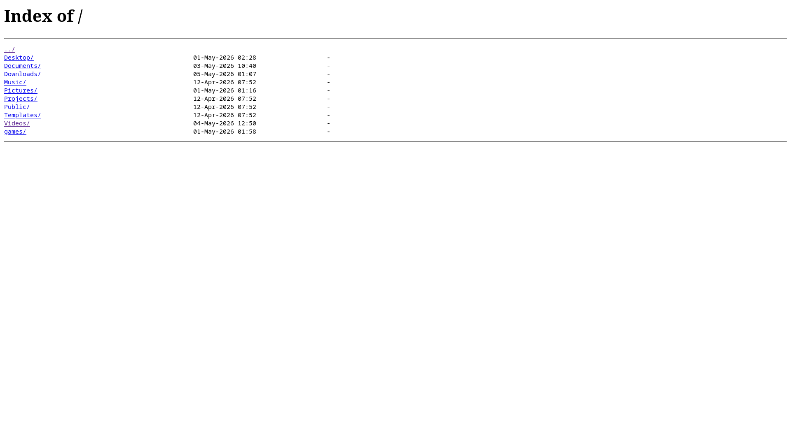
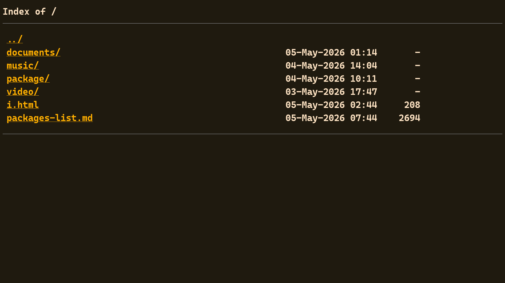

# Nginx 搭建下载站

> 好困啊...睡醒了再写吧...zzz

> 睡醒了，开写！

当我们的网站需要提供下载多文件服务时，手写下载链接是非常麻烦的。

## 启用 Autoindex 选项

Nginx 的 `autoindex` 配置在没有找到索引的 html 文件时，会直接遍历目录下的所有文件，将其转换为含下载链接的 html 文件发送给客户端。

在 `nginx.conf` 中配置以下板块：

```txt
http {
    server{

        listen 80;
        server_name localhost;

        location / {

            root /home/fovlin;
            autoindex on;
            autoindex_exact_size off;

        }
    }
}
```

其中 `autoindex on;` 表示开启自动索引功能，`autoindex_exact_size off;` 表示关闭精确显示，以 `MB` 和 `GB` 单位显示文件大小。

随后访问网站即可看到以下内容：



> autoindex 不会显示以 `.` 开头的文件，可以以此隐藏想要隐藏的文件，但仍然可以通过 URL 访问。

## Autoindex 页面美化

但是默认页面浇较丑，这是 Nginx 内置模块在接受客户端请求时自动生成的页面，无法直接通过 html 改变布局，改变外观通常有以下 2 种方法。

### 使用 add_before_body 或 add_after_body 进行美化

但可以间接使用 `add_before_body` 在头部或使用 `add_after_body` 添加含有 `<style>` 标签的空 html 文件实现自定义。

该功能依赖 `ngx_http_addition_module` 模块，需要重新配置编译选项，配置时候添加参数 `--with-http_addition_module`，并重新安装，随后停止并重新启动 nginx。

在要启用 `autoindex` 的页面配置板块根目录或子目录下创建一个 html 文件，以 `/.autoindex.html` 为例，并在配置文件写入以下配置：

```txt
http {
    server{

        listen 80;
        server_name localhost;

        location / {

            root /home/fovlin;
            autoindex on;
            autoindex_exact_size off;
            add_before_body /.autoindex.html # <--此处

        }
    }
}
```

重载 nginx：

```bash
sudo nginx -s reload
```

随后在 `.autoindex.html` 写入包含 CSS 样式的 `<style>` 标签

```html
<style>
pre {
    line-height: 32px;
}

a {
    color: #ffaf00;
    font-size: 20px;
    padding: 0px 12px;
}

a:hover {
    color:#ff00af;
}

h1 {
    font-size:22px;
}

html,body {
    color: bisque;
    background: #1f1a0f;
    font-size: 20px;
    font-weight: bold;
    font-family: 'Cascadia code','menlo';
}
```

回到页面刷新后可以看到以下效果：



### 使用 fancyindex 开源项目进行美化

项目地址：[Fancyindex](https://github.com/aperezdc/ngx-fancyindex)