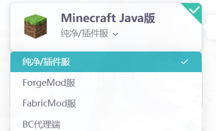
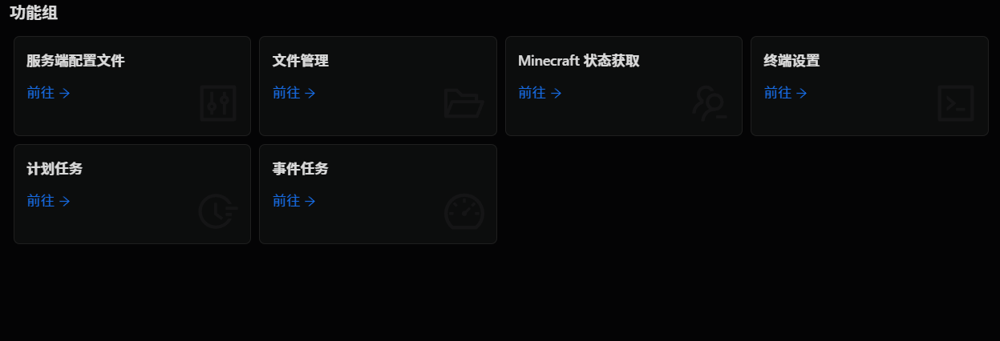

# 雨云面板搭建服务端


>如果不清楚性能是否足够，可以选择试用一天，这会收取你很少的费用去允许你使用云服务器一整天，你可以尝试对于你的服务端他的性能如何，然后选择是否购买

## 前往[雨云官网](https://app.rainyun.com/)购买/试用面板服

### 进入官网

进入官网注册/登录后，点击游戏云-购买游戏云

在这里会给出三种选择，推荐MCSM面板和雨云面板，两种面板的详细教程在后续会提到

### 选择你需要的服务端

在下方的选择Minecraft Java版，有四种选择，分别是`纯净/插件服` `Forge端Mod服` `Fabric段Mod服` `以及BC代理端`


- 如果你需要在服务器中添加mod，或者搭建整合包服务端，你应该首先了解你想要游玩的模组或整合包所使用的模组加载器的类型，选择对应的服务端

- 纯净服分为插件服和BE代理端可选，其中BE代理端本质上是插件服的一种，它允许基岩版玩家通过代理层加入你所创建的Java端服务器

下面给出一些选择指南

## 服务端的选择

### 纯净服

若选择插件服，下方会列出一些插件/纯净服务端核心，推荐使用Paper或Spigot，两种服务端插件生态丰富，运行稳定，如果你不使用任何插件，也可以选择Mojang官方服务端核心。

- 如果你没有添加模组的需要，仅仅想要体验原版带来的乐趣，推荐选择纯净服，相较于模组服，纯净服生命周期更长，且更稳定！

### Forge/Neoforge模组服务端

若选择Forge，下方会列出一些Forge及其以Forge为基础的服务端核心推荐使用Neoforge和Forge，若有添加插件的需要，建议选择Mohist，此核心同时支持Neoforge类型的模组和Paper/Bukkit/Spigot插件

- Forge 系列的服务端适合中/大型整合包服务器。

### Fabric

若选择Fabric，下方会列出一些Fabric及其以Fabric为基础的服务端核心

- Fabric 服务端适合需要少量 mod 的服务器。

### 购买

在选择好你的服务端版本后，点击购买/试用，雨云会询问是否需要正版验证，即是否需要对玩家身份进行正版验证
:::caution

若需要允许离线玩家进入，请选择离线模式

:::
然后在下方详细配置后，购买/试用

## 进入面板搭建服务端
（MCSM面板，Paper核心为例）
### 登入面板并进入控制台

在官网首页-总览-游戏云中找到刚刚购买好的游戏云

点击进入面板，输入雨云提供的账号/密码后登录

:::note
你也可以在MCSM面板首页右上方-重置密码来更改你的密码
:::

在首页，雨云已经提前为你创建了服务端，点击进入控制台

### 运行你的服务端


控制台上方点击开启，服务端会开始运行

对于Paper核心，出现以下输出即成功开始运行

```log
[12:23:06 INFO]: *************************************************************************************
[12:23:06 INFO]: This is the first time you're starting this server.
[12:23:06 INFO]: It's recommended you read our 'Getting Started' documentation for guidance.
[12:23:06 INFO]: View this and more helpful information here: https://docs.papermc.io/paper/next-steps
[12:23:06 INFO]: *************************************************************************************
```

对于Neoforge或其他服务端，出现以下输出则运行成功
```log
[14:05:25] [Server thread/INFO] [minecraft/DedicatedServer]: Done (2.142s)! For help, type "help"
[14:05:26] [Server thread/INFO] [ne.ne.ne.se.pe.PermissionAPI/]: Successfully initialized permission handler neoforge:default_handler
```

此时的完整的配置文件也会自动被生成

### 配置你的服务端

停止运行后

在控制台下滑能够看到这些功能



你可以通过这些功能对你的服务端进行管理

:::coution
不要随意更改端口，游戏云中端口未完全开放，而是开放了一些必要端口，若更改为未开放的端口导致无法将服务器映射到公网中
:::


### 在多人游戏中连接你的服务器

随后需要找到设备的公网ip，并确保Minecraft服务端端口对应的防火墙规则为开启，在你购买的云服务商控制台主页找到购买的云服务器，找到公网ip并复制，同时寻找安全组/防火墙等字眼，并前往该页面开启放通MC服务端端口对应的防火墙

此时进入与服务端版本相同的Minecraft客户端后，进入多人游戏，添加服务器，地址填写如下
```
你的公网ip:端口号
```
完成后随后即可看到在多人游戏中看到该服务器，此时Paper服务端已经搭建完成


<br/>
<br/>
<br/>

***<center>--- 由 柏茯灵_RsDline 编写 ---</center>***