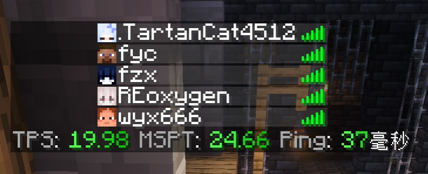

# MC服务器性能优化


## 服务器性能指标

在开始优化你的服务器之前，你应该了解一些 MC 的性能指标。

MC 服务器中存在一些性能指标，保证这些指标在正常的范围内，可以让你的玩家在服务器中得到流畅的体验。

推荐在服务器上安装 TabTps 插件来方便观察服务器的一些性能指标。

### TPS

tps 为每秒进行的游戏刻数量，正常游戏中，每秒游戏会进行20刻，如果服务器卡顿，tps会显著下降，只要你的服务器没有过载，tps 应保持 20。

tps 与下文的 mspt 有着很大的关系，mspt 的数值直接决定了 tps 的高低。

### MSPT

mspt 为计算一个游戏刻度所需要的时间，单位为毫秒/ms（一秒为 1000ms），该指标的数值将直接影响 tps，mspt 在大于 50 时，即处理一个游戏刻需要的时间大于 50ms，换算下来，服务器将无法在 1s 内计算 20 个游戏刻，tps 会明显下降，正常服务器的 mspt 应保持在 50 以下。

mspt 的数值与游戏内一切占用 CPU 的行为有关，占用越高，mspt 数值越高。

:::tip
MC 的大部分运算都在单线程上，很容易出现CPU的一个核心跑满，其他核心占用非常低的情况，**当主线程所在的核心跑满时，mspt 就会显著升高**。

主线程核心是不固定的，会在所有的核心之间变动，也很容易注意到会有一个核心占用达到 100%，而其他核心占用仅仅 10~20% 的情况，这很正常。
:::

### ping

ping 为向服务器发送数据包，直到收到回应所需的时间，单位为毫秒，ping值越大，延迟也就越高，当服务器负载过高时，服务器可能无法处理请求，也会导致 ping值过高。

在保证服务器主线程所在的核心负载不会过高的情况下，该数值可以可以通过优化网络来调整，在这里不会着重对此项进行优化。

安装 TabTps 插件，服务器游戏内按下 tab 键可以观察到服务器的这些性能指标。（来自群友的截图）




## 进行优化

了解上述的指标后，我们可以开始优化服务端，最应该注意的是 mspt 的数值，也就是减少 CPU 的占用，以下几个因素最容易占用 CPU。

- 实体数量

- 生物AI

- 复杂的红石电路

- 区块的生成

### 预生成区块

生成新的区块文件会消耗大量的性能，可以选择提前生成区块文件，仅需生成一次文件，这样当玩家在地图中游玩的时候，服务器仅需将区块数据发送给玩家即可。

**使用 [Chunky](https://modrinth.com/plugin/chunky?loader=paper) 插件来提前生成区块文件**

Chunky 同时也是一个模组，在客户端也可以使用，且方法相同，用法如下。

快速开始使用：

- chunky radius \<radius\> 设置半径
- chunky center [\<x\> \<z\>] 设置中心块
- chunky start 在当前选区中开始新生成
- chunky pause 暂停并保存当前区块生成任务
- chunky continue 继续运行当前或保存的区块生成任务
- chunky cancel 停止并取消当前运行中的区块生成任务
- chunky progress 在游戏中显示所有任务的预生成进度

Chunky 默认选择（0，0）作为中心，500 作为半径，直接使用以下命令会以默认值开始生成:

```text
/chunky start
```

假设我们以世界（256，256）为中心，生成半径 1280 格的区块文件，可以这样输入命令：

```text
/chunky radius 1280

/chunky center 256 256

/chunky start
```

在控制台会产生如下输出：

```log
[05:54:49 INFO]: [Chunky] Task started in world for the square region centered at 1280, 1280 with radius 1280.
[05:54:49 INFO]: [Chunky] Task running for world. Processed: 51 chunks (1.21%), ETA: 0:00:13, Rate: 320.8 cps, Current: 13, 2
[05:54:50 INFO]: [Chunky] Task running for world. Processed: 451 chunks (10.67%), ETA: 0:00:09, Rate: 380.9 cps, Current: 13, 16
```

更多命令不做过多赘述，参考如下：

- chunky selection 展示当前选区
- chunky world [world] 设置选中的世界
- chunky shape \<shape\> 设置目标形状
- chunky center [\<x\> \<z\>] 设置中心块
- chunky worldborder 设置中心和半径以匹配所选世界的世界边界
- chunky spawn 设置中心至出生点
- chunky corners \<x1\> \<z1\> \<x2\> \<z2\> 根据角坐标设置选区
- chunky pattern \<pattern\> 设置首选生成模式
- chunky silent 开关显示更新信息
- chunky quiet \<interval\> 设置更新消息的静默间隔(以秒为单位)
- chunky reload 重新加载配置
- chunky trim 删除选区之外的块

### 关闭不必要的生物AI

村民的 AI 是所有生物中最复杂的，对 CPU 的占用也非常高，当服务器中存在过多的村民时，过多的村民AI会吃掉服务器的大部分性能，禁用不必要的村民的 AI 是非常必要的。

**修改 nbt 来禁用生物的AI**

使用 /data 命令可以修改 nbt 数据，在村民的 nbt 标签中插入 {NoAI:"1b"} 即可禁用村民的生物 AI，使用以下命令修改村民的 nbt 标签来禁用 AI

```text
/data merge entity @e[limit=1,type=villager,sort=nearest,distance=..5,nbt=!{NoAI:"1b"}] {{NoAI:"1b"}}
```
此命令将选择5格内距离你最近的1名没有禁用 AI 的村民，并禁用其生物 AI。

如果批量禁用也很简单，仅需将以下命令放入循环型命令方块中，然后围绕着所有的村民跑一圈即可。

```text
execute at <你的游戏ID> run data merge entity @e[limit=1,type=villager,sort=nearest,distance=..5,nbt=!{NoAI:"1b"}] {{NoAI:"1b"}}
```

:::danger
不要禁用交易村民的AI，这会使村民无法正常补货！！！
:::

<br/>
<br/>
<br/>

***<center>--- 由 柏茯灵_RsDline 编写 ---</center>***